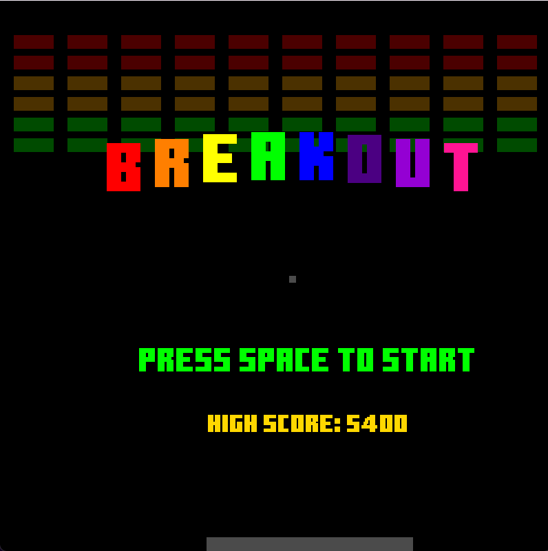
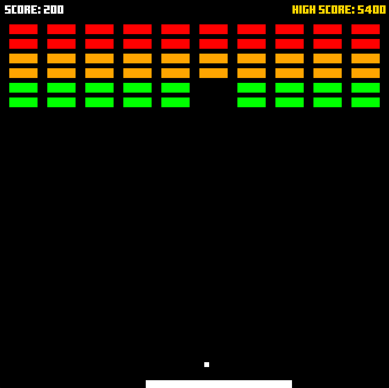
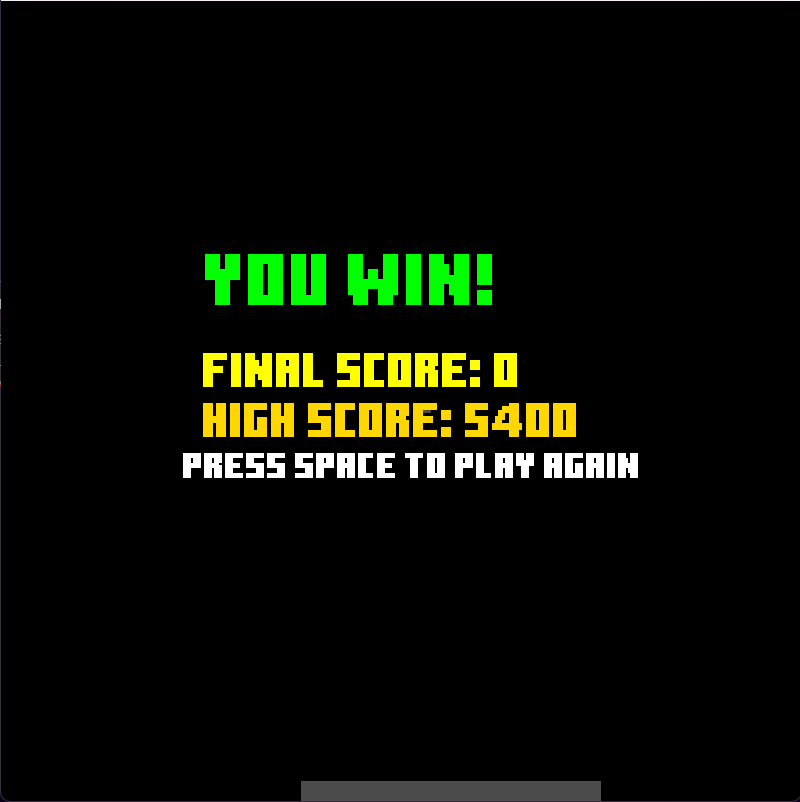
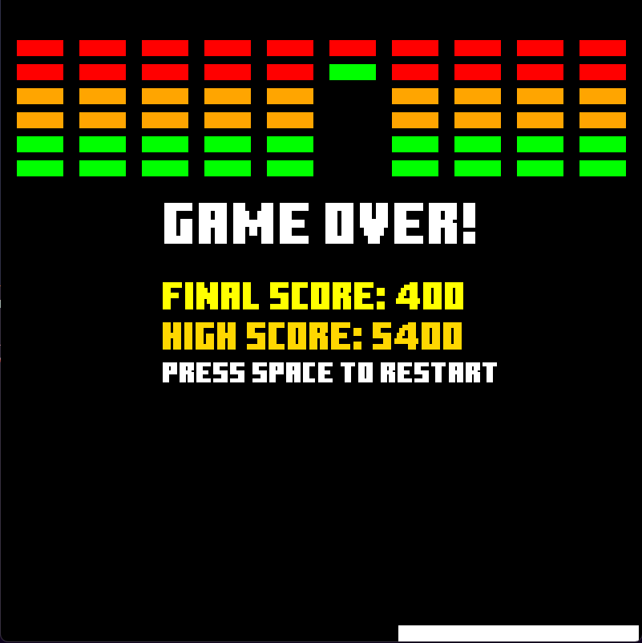
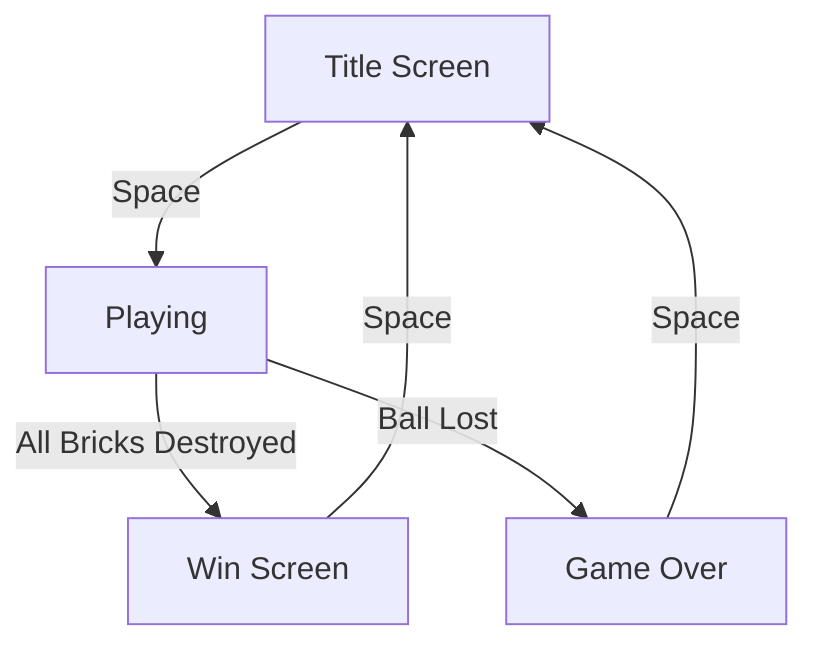

# 🎮 BreakOut Game

<div align="center">


[](https://en.cppreference.com/)
[](https://www.libsdl.org/)
[](https://cmake.org/)
</div>

## 📝 Description

A classic arcade-style BreakOut game built with modern C++ and SDL2. Break all the bricks with your ball while controlling the paddle to prevent the ball from falling! Features multiple brick types, progressive difficulty, and high score tracking.

## 🖼️ Game Screens

<div align="center">

### 🎮 Start Screen


### 🎲 Playing Screen


### 🏆 Win Screen


### ❌ Game Over Screen


</div>

## 🎯 Game Features

- 🏓 Smooth paddle controls
- 🔴 Multiple brick types with different hit points
- ⚡ Dynamic ball physics with speed progression
- 🎨 Clean visual design with animations
- 🏆 Score system and high score tracking
- 🎮 Multiple game states (Title, Playing, Win, Game Over)
- 💾 Persistent high score storage

## 🎮 Controls

| Key | Action |
|-----|--------|
| ⬅️ Left Arrow | Move paddle left |
| ➡️ Right Arrow | Move paddle right |
| ⏎ Space | Start/Restart game |
| ❌ Escape | Exit game |

## 🧱 Brick Types

| Color | Hits Required | Points |
|-------|---------------|--------|
| 🟢 Green | 1 | 10 |
| 🟠 Orange | 2 | 20 |
| 🔴 Red | 3 | 30 |

## 🎯 Game Mechanics

- Ball speed increases as bricks are destroyed
- Different brick types require multiple hits
- Score based on brick type and destruction
- High score persistence between sessions
- Dynamic paddle collision angles

## 🔄 Game States



## 📁 Project Structure

### 🎯 Core Files
- `main.cpp` - 🎮 Game loop and core logic
- `window.cpp/h` - 🖼️ SDL window management
- `entity.cpp/h` - 🎲 Game objects (paddle, ball, bricks)

### 🛠️ Support Files
- `vector2.cpp/h` - ➡️ 2D vector mathematics
- `rectangle.cpp/h` - 📦 Collision shapes
- `colour.cpp/h` - 🎨 Color management
- `key_event.h` - ⌨️ Input handling

## 🚀 Building the Game

### Prerequisites
- 📌 C++20 compiler
- 📌 SDL2 library
- 📌 CMake 3.10+

### Build Steps

```bash
# 1. Clone the repository
git clone https://github.com/Prince-Patel84/asm_c_cpp/tree/develop/cpp

# 2. Create build directory
mkdir build
cd build

# 3. Generate build files
cmake ..

# 4. Build the game
cmake --build .
```

## 🎮 How to Play

1. 🚀 Launch the game
2. 🏓 Use left and right arrows to move the paddle
3. 🎯 Bounce the ball to break all bricks
4. 🏆 Try to clear all bricks without losing the ball
5. 📊 Score points based on brick type
6. 💾 Beat your high score!

## 🔧 Technical Implementation

### Physics System 🎯
- Accurate ball bouncing mechanics
- Precise collision detection
- Dynamic paddle reflection angles
- Progressive ball speed system

### Rendering Engine 🎨
- Hardware-accelerated graphics
- Smooth animations
- Efficient frame rendering
- Dynamic color transitions

### Game State Management 🎮
- Title screen with animations
- Playing state with score display
- Win condition with final score
- Game over state with restart option

### Score System 📊
- Points based on brick type
- High score tracking
- Persistent storage
- Visual score display

## 🛠️ Future Enhancements

- [ ] 🔊 Sound effects
- [ ] 🎯 Multiple levels
- [ ] ⚡ Power-ups
- [ ] 💖 Lives system
- [ ] 🎨 Custom themes

## 📜 License

<div align="center">

[](https://www.boost.org/LICENSE_1_0.txt)

Built with 💖 and lots of 🎮
</div>

---

<div align="center">

### 🌟 Star this repository if you find it helpful!

</div>