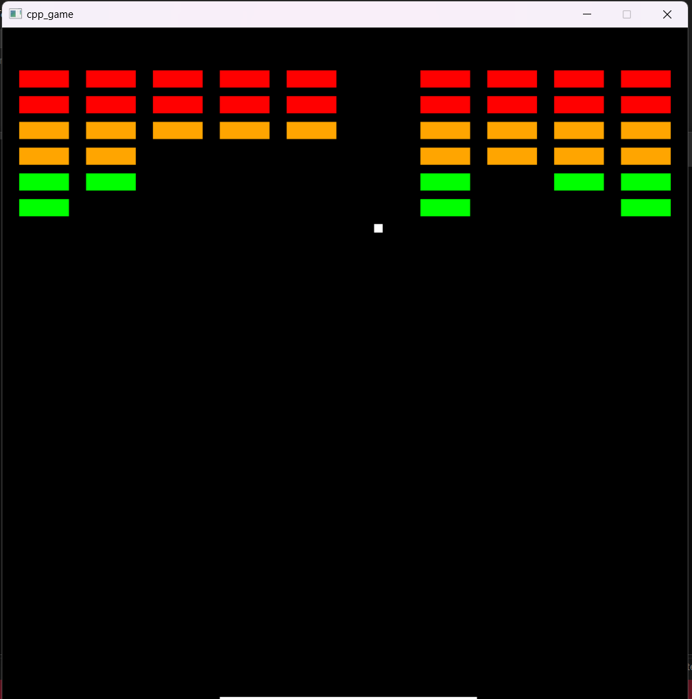
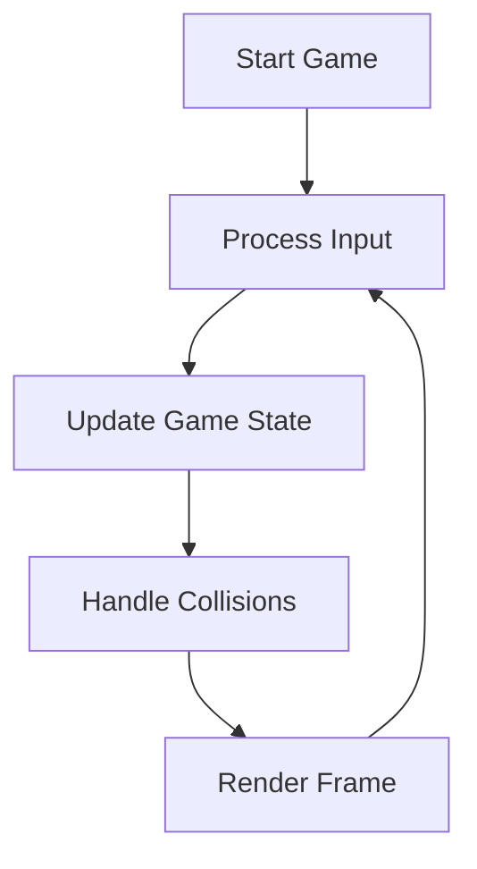

# 🎮 Brick Breaker Game

<div align="center">



[](https://en.cppreference.com/)
[](https://www.libsdl.org/)
[](https://cmake.org/)
</div>

## 📝 Description

A classic arcade-style Brick Breaker game built with modern C++ and SDL2. Break all the bricks with your ball while controlling the paddle to prevent the ball from falling!

## 🎯 Game Features

- 🏓 Smooth paddle controls
- 🔴 Colorful brick layouts
- ⚡ Dynamic ball physics
- 🎨 Clean visual design

## 🎮 Controls

| Key | Action |
|-----|--------|
| ⬅️ Left Arrow | Move paddle left |
| ➡️ Right Arrow | Move paddle right |
| ❌ Escape | Exit game |

## 🔄 Game Loop Overview



## 📁 Project Structure

### 🎯 Core Files
- `main.cpp` - 🎮 Game loop and core logic
- `window.cpp/h` - 🖼️ SDL window management
- `entity.cpp/h` - 🎲 Game objects (paddle, ball, bricks)

### 🛠️ Support Files
- `vector2.cpp/h` - ➡️ 2D vector mathematics
- `rectangle.cpp/h` - 📦 Collision shapes
- `colour.cpp/h` - 🎨 Color management
- `key_event.h` - ⌨️ Input handling

## 🚀 Building the Game

### Prerequisites
- 📌 C++20 compiler
- 📌 SDL2 library
- 📌 CMake 3.10+

### Build Steps

```bash
# 1. Clone the repository
git clone https://github.com/Prince-Patel84/asm_c_cpp

# 2. Create build directory
mkdir build
cd build

# 3. Generate build files
cmake ..

# 4. Build the game
cmake --build .
```

## 🎮 How to Play

1. 🚀 Launch the game
2. 🏓 Use left and right arrows to move the paddle
3. 🎯 Bounce the ball to break all bricks
4. 🏆 Try to clear all bricks without losing the ball

## 🔧 Technical Implementation

### Physics System 🎯
- Accurate ball bouncing mechanics
- Precise collision detection
- Dynamic paddle reflection angles

### Rendering Engine 🎨
- Hardware-accelerated graphics
- Smooth animations
- Efficient frame rendering

## 🛠️ Future Enhancements

- [ ] 🏆 Score system
- [ ] 🎵 Sound effects
- [ ] ⭐ Power-ups
- [ ] 🎯 Multiple levels
- [ ] 📊 High score board

## 📜 License

<div align="center">

[](https://www.boost.org/LICENSE_1_0.txt)

Built with 💖 and lots of 🎮
</div>

---

<div align="center">

### 🌟 Star this repository if you find it helpful!

</div>